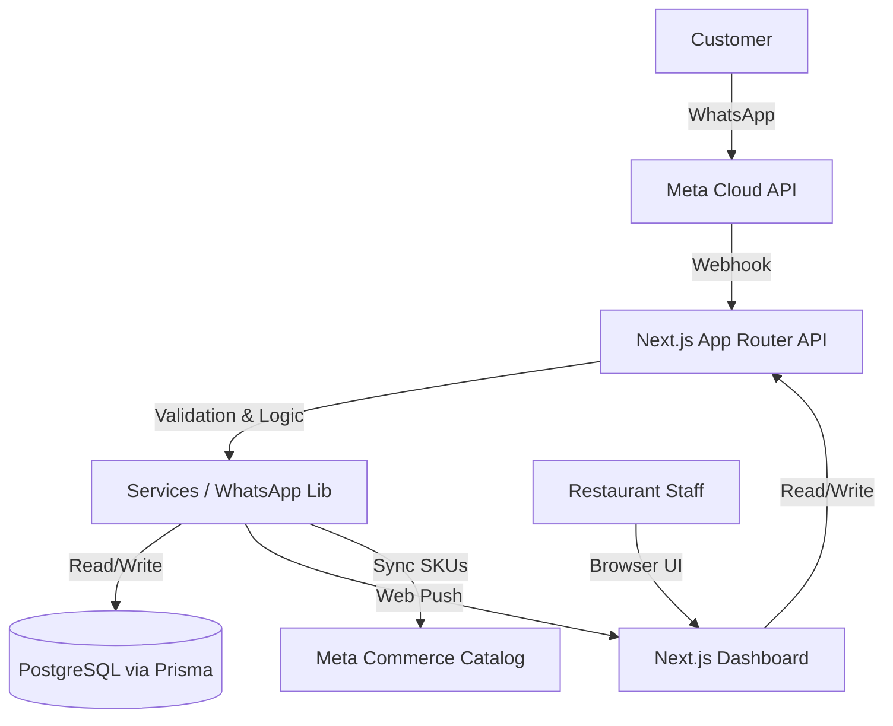
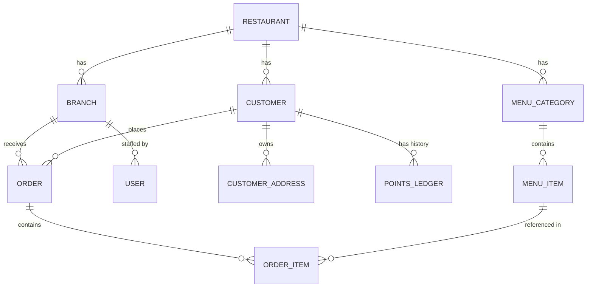

# RestroConnect — COMPLETE SOURCE CODE, SYSTEM ARCHITECTURE & DATABASE TECHNICAL REPORT

## 1. PROJECT OVERVIEW
**Project Purpose:** RestroConnect is a full-featured restaurant management, Point of Sale (POS), and customer engagement platform. Its primary goal is to manage multi-branch restaurant operations, unify offline POS and online WhatsApp orders, and provide built-in Customer Relationship Management (CRM) and loyalty programs.

**Current Architecture:** 
The application uses a modern Server-Side Rendered (SSR) architecture built on Next.js 14/15 App Router. It acts as both the backend API and the frontend dashboard. 
- The backend leverages Prisma ORM connecting to a PostgreSQL database. 
- The external integrations include a seamless WhatsApp Bot powered by Meta Cloud APIs and Meta Commerce Catalogs for menu synchronization and native WhatsApp ordering.
- The UI uses Tailwind CSS, potentially combined with Radix or Shadcn UI primitives for accessibility.

**Main Modules/Features:**
- Multi-branch and Multi-tenant (Restaurant) management.
- Real-time Point of Sale (POS) and Order Management System (OMS).
- WhatsApp Bot Integration (Native Meta Catalogs and Checkout).
- Menu & Category Management (Variants, Add-ons).
- CRM & Loyalty Point System.
- Web Push Notifications for staff.
- Thermal Printer Settings Management.

---

## 2. TECHNOLOGY STACK
- **Frameworks:** Next.js (App Router), React 19
- **Languages:** TypeScript, Node.js
- **Database:** PostgreSQL
- **ORM:** Prisma Client & Prisma Postgres Adapter (v7.9.1)
- **Authentication:** NextAuth.js (Session-based, bcrypt for hashing)
- **Libraries/Packages:** 
  - `chart.js` & `react-chartjs-2` (Analytics)
  - `exceljs` & `jspdf` (Exporting & Reporting)
  - `zod` (Data validation)
  - `web-push` (Browser Notifications)
  - `react-hot-toast` (Toast notifications)
  - `tailwindcss` (Styling)
- **External APIs:** Meta WhatsApp Cloud API, Meta Commerce Catalog API.

---

## 3. COMPLETE SOURCE CODE STRUCTURE
### Key Folders & Files:
- `prisma/schema.prisma`: The central nervous system of the app. Defines 18 database models encompassing tenants, users, orders, CRM, menus, and WhatsApp state.
- `src/app/`: The Next.js App Router containing all pages and API routes.
  - `(dashboard)/`: Contains all authenticated UI routes like `/orders`, `/menu`, `/customers`, etc.
  - `api/`: Contains REST endpoints and webhooks. Crucially, `api/webhooks/whatsapp/route.ts` handles all incoming WhatsApp bot traffic.
  - `login/`: The authentication entry point.
- `src/components/`: Reusable React components.
  - `ClientAppShell.tsx` & `SidebarNav.tsx`: Layout and navigation.
  - `OrderBoard.tsx` & `OrderDrawer.tsx`: The core interfaces for managing active orders in real-time.
  - `menu/`: Modals and views for bulk importing, duplicating, and managing menu items.
- `src/lib/`: Core backend services and utilities.
  - `whatsapp/`: Highly sophisticated module handling WhatsApp state (`router.ts`), Meta Catalog Sync (`catalog.ts`), Cart interactions (`cart.ts`), and HTTP client wrappers (`client.ts`).
  - `prisma.ts`: Database client initialization.
  - `crm.ts`, `loyalty.ts`: Business logic for customer interactions and point ledgers.
  - `webpush.ts`, `notifications.ts`: Notification delivery services.

---

## 4. FRONTEND
The frontend is heavily dashboard-oriented, tailored for restaurant staff and administrators.

**Pages/Routes:**
- `/login`: NextAuth credential-based login.
- `/dashboard`: High-level metrics and analytics.
- `/orders` (POS & Order Management): Central hub for viewing active orders (`OrderBoard`), tracking statuses, and printing receipts.
- `/menu` & `/categories`: Interfaces for creating products, assigning variants/add-ons, and syncing to Meta Catalogs.
- `/customers` & `/customers/offers`: CRM views detailing customer order history, points balances, and campaign management.
- `/settings`, `/settings/loyalty`, `/settings/printer`: Configuration screens for restaurant behavior, reward programs, and thermal printer formatting.

**Architecture:** 
The UI is fully responsive (Mobile, Tablet, Desktop) using standard Tailwind CSS classes. It employs a `ClientAppShell` that collapses the sidebar on mobile devices. Reusable components include modals (`MenuManagementView`, `CategoryModal`) and dynamic badges (`StatusBadge`).

---

## 5. BACKEND
Built entirely on Next.js API Routes (Serverless Functions) and Server Actions.

**Important API Routes:**
- `GET/POST /api/menu/items`: CRUD operations for menu items.
- `POST /api/menu/items/bulk-import`: Parses external files (like CSVs/Excel via `exceljs`) for bulk creation.
- `POST /api/webhooks/whatsapp`: The primary webhook listener for Meta. Parses incoming messages and native catalog orders, then delegates to `src/lib/whatsapp/router.ts`.
- `GET /api/cron/automations` & `/api/cron/auto-deliver`: Endpoints intended to be called by external chron-jobs (like Vercel Cron) to auto-transition orders or send automated CRM campaigns.
- `POST /api/push/subscribe`: Registers service worker endpoints for browser notifications.

**Business Logic Flow:** Validation is predominantly handled via `zod`. Error handling returns standard JSON error responses. `branch-scope.ts` ensures that data fetched is scoped exclusively to the authenticated user's assigned branch or restaurant.

---

## 6. WHATSAPP SYSTEM
The WhatsApp integration is the most complex sub-system in the repository.

**Flow & State Management:**
- Incoming Webhooks hit `api/webhooks/whatsapp/route.ts` which hands off to `router.ts`.
- The bot handles native Meta Catalog payloads (`handleNativeOrderMessage`). When a customer submits an order via the native catalog, the bot parses the `orderPayload.productItems`, validates them against the database, and constructs a `WhatsAppCart`.
- State is maintained in the `WhatsAppCart` table (e.g., `checkout_step` tracks if the user is `AWAITING_ORDER_NOTE` or `AWAITING_ORDER_TYPE`).

**Core Features:**
- **Native Catalog Orders:** No custom product lists are generated. The bot forces the user to the native WhatsApp catalog, capturing the resulting order payload.
- **Order Tracking & Cancellation:** Users can request updates on their orders natively.
- **Catalog Synchronization:** `src/lib/whatsapp/catalog.ts` provides logic for taking local Prisma `MenuItem` data and syncing it upstream to the Meta Commerce Manager.

---

## 7. POS SYSTEM
The POS (Point of Sale) system is integrated directly into the dashboard.

**Features:**
- **Order Creation:** Staff can manually punch in orders via `/dev/create-order` or a similar POS view.
- **Order Types:** Supports `DINING`, `TAKEAWAY`, and `HOME_DELIVERY`.
- **Billing & Payments:** Supports `CASH`, `ONLINE`, and `COD` (Cash on Delivery).
- **Printing:** Integrated with `PrinterSettingsView` to format thermal printer receipts directly from the browser.

---

## 8. ORDER MANAGEMENT
**Lifecycle (Statuses):** `NEW` → `IN_PROCESS` → `OUT_FOR_DELIVERY` → `DELIVERED` (or `REJECTED`/`CANCELLED`).

- **History Tracking:** The `OrderStatusHistory` table tracks every state transition, who changed it, and why.
- **Behavior:** Orders from `WHATSAPP` enter as `NEW` and trigger Web Push notifications to the dashboard. `POS` orders can be marked `PAID` immediately.

---

## 9. MENU SYSTEM
A deeply relational menu system supporting complex pricing models.
- **Hierarchy:** `MenuCategory` → `MenuItem` → `MenuItemVariant` / `MenuItemAddon`.
- **Soft Deletion & Availability:** Items can be toggled via `is_available` or soft-deleted via `deleted_at`.
- **Meta Sync:** Items track their Meta Commerce state via `meta_product_sku`, `meta_sync_status`, and `meta_sync_error`.
- **Specials:** Features like `is_today_special` and `special_until_date` are supported.

---

## 10. CUSTOMER / CRM
A comprehensive CRM tracking every customer interaction.
- **Customer Profiles:** Tracks names, WhatsApp numbers, DOB, and overall points balances.
- **Addresses:** `CustomerAddress` stores multiple delivery locations per customer with Geocoding and distance calculation support.
- **Customer 360:** `CustomerActivity` and `CustomerNote` track staff-added notes and automated events (e.g., "Placed Order", "Redeemed Points").
- **Campaigns:** `CustomerCampaign` allows staff to bulk-send WhatsApp templates based on segments (e.g., "Inactive 30 days").

---

## 11. LOYALTY / REDEEM POINTS
A fully-fledged double-entry ledger system.
- **Ledger:** `PointsLedger` tracks `EARN`, `REDEEM`, `REFUND`, and `REVERSAL` transactions.
- **Settings:** Defined on the `Restaurant` model (`loyalty_points_value_inr`, `loyalty_amount_for_one_point`, `loyalty_min_order_value`).
- **Flow:** When an order completes, `loyalty.ts` calculates and awards points. During checkout, points can be redeemed to apply a `points_discount_inr`.

---

## 12. BRANCH ARCHITECTURE
The system is strictly multi-tenant.
- **Restaurant (Tenant):** The overarching corporate entity holding global configurations (WhatsApp credentials, Loyalty rules).
- **Branch:** Physical locations. Each branch has its own `delivery_free_distance_km` and `is_active` toggle.
- **Users:** `UserRole` defines if someone is a `SUPER_ADMIN` (access to all branches) or `BRANCH_STAFF` (isolated to one branch).

---

## 13. DELIVERY SYSTEM
- **Address Handling:** Supports normalized addresses and manual coordinate overrides (`latitude`, `longitude`).
- **Distance Calculation:** `calculated_distance_km` is computed on the fly.
- **Charges:** Branch settings define `delivery_free_distance_km` and `delivery_extra_charge_per_km`. The cart automatically calculates the `delivery_charge` based on `delivery_charge_rounding` rules.

---

## 14. NOTIFICATIONS
- **Web Push:** Implemented using standard Service Workers and the `web-push` npm package. Handled by `PushNotificationManager.tsx` on the frontend.
- **VAPID Keys:** Stored in environment variables to securely sign push messages.
- **Use Case:** Instantly alerts dashboard users (staff) when a new WhatsApp order arrives or when a customer cancels an order.

---

## 15. PRINTING
- **Implementation:** `PrinterSettingsView.tsx` allows customization of header/footer text and paper width.
- **Capabilities:** Uses standard browser printing (`window.print()`) combined with CSS `@media print` queries to format raw HTML into thermal-printer compatible layouts.

---

## 16. DATABASE — VERY DETAILED
The database is a highly relational PostgreSQL schema accessed via Prisma.

### Core Models:
1. **Restaurant**: 
   - *Purpose*: The main tenant. 
   - *Fields*: `id` (UUID, PK), `name`, `slug` (Unique), `whatsapp_phone_number_id` (Unique), Loyalty configurations.
   - *Relations*: 1-to-Many with Branches, Users, Categories, Orders, Customers.
2. **Branch**: 
   - *Purpose*: Physical location.
   - *Fields*: `id`, `restaurant_id` (FK), `latitude`, `longitude`, Delivery configs.
   - *Indexes*: Unique compound on `[restaurant_id, code]`.
3. **User**: 
   - *Purpose*: Staff authentication.
   - *Fields*: `email` (Unique), `password_hash`, `role` (Enum: SUPER_ADMIN, BRANCH_ADMIN, BRANCH_STAFF).
4. **Customer**:
   - *Purpose*: CRM base.
   - *Fields*: `phone`, `points_balance`.
   - *Indexes*: Unique compound on `[restaurant_id, branch_id, phone]`.
5. **CustomerAddress**:
   - *Fields*: `latitude`, `longitude`, `calculated_distance_km`.
6. **MenuCategory** & **MenuItem**:
   - *Purpose*: Catalog structure. 
   - *Relations*: MenuItem has many `MenuItemVariant` and `MenuItemAddon`. OnDelete cascades ensure cleanup.
7. **Order** & **OrderItem**:
   - *Purpose*: Financial records.
   - *Fields*: `order_number` (Unique), `subtotal`, `delivery_fee`, `total`, `status` (Enum).
8. **OrderStatusHistory**:
   - *Purpose*: Audit trail.
9. **WhatsAppCart** & **WhatsAppCartItem**:
   - *Purpose*: Temporary session storage for active WhatsApp flows.
   - *Fields*: `checkout_step`, `applied_points`.
10. **PointsLedger**:
    - *Purpose*: Append-only point history.
11. **CustomerCampaign** & **CampaignReceipt**:
    - *Purpose*: Tracks WhatsApp marketing blasts to prevent duplicate sends.

**Isolation & Integrity:** Every major model contains `restaurant_id` and `branch_id`. `onDelete: Cascade` is heavily utilized to ensure tenant data is completely wiped if a Restaurant/Branch is deleted.

---

## 17. SECURITY
- **Authentication:** `NextAuth.js` with `bcryptjs` for local email/password authentication.
- **Authorization:** Handled in route handlers via the `branch-scope.ts` utility which verifies the `UserRole`.
- **Tenant Isolation:** Enforced deeply in database queries. Almost all `where` clauses require `restaurant_id`.
- **Input Validation:** Extensive use of `zod` for API request body validation.

---

## 18. EXTERNAL INTEGRATIONS
1. **Meta WhatsApp Cloud API**:
   - *Purpose*: Sending text, interactive messages, and receiving webhooks.
   - *Location*: `src/lib/whatsapp/client.ts`.
   - *Auth*: Bearer token (`WHATSAPP_ACCESS_TOKEN`).
2. **Meta Commerce Catalog**:
   - *Purpose*: Syncing menu items to WhatsApp shops.
   - *Location*: `src/lib/whatsapp/catalog.ts`.
   - *Auth*: Same as WhatsApp API.
3. **Web Push (VAPID)**:
   - *Purpose*: Real-time browser notifications for staff.
   - *Location*: `src/lib/webpush.ts`.

---

## 19. ENVIRONMENT VARIABLES
- `DATABASE_URL`: **Required**. Connection string for Prisma (PostgreSQL). Secret.
- `NEXTAUTH_SECRET`: **Required**. Secret string to encrypt session cookies. Secret.
- `NEXTAUTH_URL`: **Required**. Base URL of the application. Public.
- `AUTO_DELIVER_AFTER_MINUTES`: Optional. Used by cron jobs.
- `WHATSAPP_ACCESS_TOKEN`: **Required** for bot. Meta Graph API token. Secret.
- `WHATSAPP_PHONE_NUMBER_ID`: **Required**. Meta Phone ID. Public/Secret.
- `WHATSAPP_VERIFY_TOKEN`: **Required**. Used to verify Meta webhook handshakes. Secret.
- `WHATSAPP_CATALOG_ID`: Optional/Required for Native Catalog. Public.
- `VAPID_PUBLIC_KEY`: **Required**. Web Push public key. Exposed to browser.
- `VAPID_PRIVATE_KEY`: **Required**. Web Push private key. Secret.
- `VAPID_SUBJECT`: **Required**. Mailto link for push services.
- `GOOGLE_REVIEW_URL`: Optional. URL sent to customers.

---

## 20. COMPLETE USER FLOWS
**Customer WhatsApp Native Catalog Ordering:**
1. Customer sends "Hi".
2. Bot replies with a Native Catalog Message ("🍽️ Here is our menu 👇").
3. Customer browses the native WhatsApp UI, selects items, adds them to cart, and clicks send.
4. Payload hits `api/webhooks/whatsapp`.
5. `handleNativeOrderMessage` parses the Meta payload, cross-references internal SKUs, calculates totals, verifies minimum order value, and constructs a `WhatsAppCart`.
6. Bot prompts for Order Note / Type (Delivery/Takeaway).
7. If delivery, bot fetches/requests address and calculates distance limits.
8. Customer confirms checkout.
9. `Order` is created in database (`status: NEW`).
10. Web Push notification fires to the dashboard.
11. Staff accepts order on POS (`status: IN_PROCESS`). Bot notifies customer.

---

## 21. CURRENT IMPLEMENTATION STATUS
**IMPLEMENTED:**
- Native Meta Catalog Integration & Parsing.
- WhatsApp Webhooks and Session Management.
- Multi-tenant Restaurant/Branch architecture.
- Full POS UI (OrderBoard, Categories, Menu Items).
- Web Push Notifications for new orders.
- CRM, Loyalty Ledger, and Automated Campaigns.

**PARTIALLY IMPLEMENTED:**
- Geocoding Distance Calculation (Infrastructure is there, relies on external APIs if "EXACT" routing is required).

**NOT IMPLEMENTED / NOT FOUND:**
- External Payment Gateways (Stripe/Razorpay etc. are absent; mostly relies on COD/Offline payments).

---

## 22. CODE QUALITY / TECHNICAL AUDIT
- **Strengths:** Excellent separation of concerns in the `whatsapp` library. Strong typing and schema definition in Prisma. Solid tenant isolation.
- **Technical Debt:** Legacy WhatsApp list-based routing logic was recently removed, but some `cart_test` or `menu_browsing_test` files in `src/lib/whatsapp/` may need updates to reflect the new Native Catalog reality.
- **Scalability Concerns:** Polling or highly concurrent webhook processing for WhatsApp might require a queuing system (like Redis/BullMQ) if message volume scales significantly, as Vercel serverless functions have execution time limits.

---

## 23. DEPLOYMENT ARCHITECTURE
- **Hosting:** Ideally suited for Vercel or Node.js Docker containers.
- **Build Command:** `npm run build` (executes `prisma generate && next build`).
- **Database:** Requires a pooled PostgreSQL connection (e.g., Supabase, Neon) due to Serverless function architecture.
- **Cron Jobs:** Relies on Vercel Cron or external services to hit `/api/cron/automations` securely.

---

## 24. FINAL ARCHITECTURE

### System Architecture

### Core Database ER Diagram

---
*End of Report*
